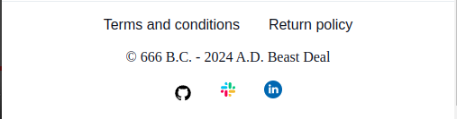

# Beast Deal

Welcome to Beast Deal, your ultimate destination for wish fulfillment! Imagine a place where your desires are not just dreams, but tangible realities waiting to be claimed. At Beast Deal, we specialize in turning aspirations into actualities, offering an unparalleled array of products and services designed to satisfy even the wildest dreams.

Explore our virtual aisles and discover a world of endless possibilities, where every click brings you closer to your heart's desires.

Join us at Beast Deal and let us turn your dreams into reality, one deal at a time.

## Existing Features

### Pages

#### Beast Deal Dashboard
The Beast Deal dashboard is designed to streamline your experience, providing intuitive navigation and essential information at your fingertips.

#### Key Features:
- Animated Avatars of Executors: Meet our dynamic team of experts represented by animated avatars, ready to assist you every step of the way.
- Navigation Bar: Effortlessly navigate through the dashboard sections, ensuring a seamless browsing experience.
- Footer with Links: Access important links, including terms and conditions, privacy policy, and more, conveniently located in the footer.
- Terms and Conditions Modal: Gain insights into our terms and conditions through a user-friendly modal window, ensuring transparency and clarity.
- Return Policy Modal: Familiarize yourself with our return policy through an informative modal window.

#### Light theme:

#### Dark theme:

#### Beast Deal Customers
Don't just take our word for it! Check out what our satisfied customers have to say about their experience with Beast Deal.

#### Key Features:
- Customer Reviews: Browse through a collection of genuine reviews and testimonials from satisfied customers.
- Card Layout: Reviews are displayed in a visually appealing card layout, making it easy to scan and engage with each testimonial.
- Dynamic Content: The content on the Customers page is dynamic, ensuring that the latest reviews are always showcased to provide visitors with up-to-date feedback.
- Responsive Design: The page is optimized for various devices and screen sizes, ensuring an optimal viewing experience for all visitors.
- Navigation Bar: Effortlessly navigate through the dashboard sections, ensuring a seamless browsing experience.
- Footer with Links: Access important links, including terms and conditions, privacy policy, and more, conveniently located in the footer.
- Terms and Conditions Modal: Gain insights into our terms and conditions through a user-friendly modal window, ensuring transparency and clarity.
- Return Policy Modal: Familiarize yourself with our return policy through an informative modal window.

#### Light theme:

#### Dark theme:

#### Beast Deal About
Meet our dedicated team of experts who work tirelessly to bring you the best deals.

#### Key Features:
- Meet Our Team: Get to know the talented individuals behind our company with detailed profiles of each team member, including their name, role, brief description, and a professional avatar.
- Card Layout: Team member profiles are presented in an elegant card layout, making it effortless to browse and learn about each individual.
- Dynamic Content: Our "About" page is regularly updated to reflect any changes in our team, ensuring that visitors always have access to the latest information about our staff.
- Responsive Design: We've optimized the page for seamless viewing across various devices and screen sizes, ensuring that visitors can easily explore our team members' profiles no matter where they are.
- Navigation Bar: Effortlessly navigate through the dashboard sections, ensuring a seamless browsing experience.
- Footer with Links: Access important links, including terms and conditions, privacy policy, and more, conveniently located in the footer.
- Terms and Conditions Modal: Gain insights into our terms and conditions through a user-friendly modal window, ensuring transparency and clarity.
- Return Policy Modal: Familiarize yourself with our return policy through an informative modal window.

#### Light theme:

#### Dark theme:

#### Beast Deal About
Meet our dedicated team of experts who work tirelessly to bring you the best deals.

#### Key Features:
- Exclusive Deals: Explore our latest offers and promotions available for our customers.
- Form Submission: Fill out a simple form with fields for your first name, last name, and your wish. Additionally, there's a checkbox to approve the terms and conditions.
- Contract Generation: Upon submission of the form and approval of the terms and conditions, a customized contract is instantly generated between you (the user) and the executor, outlining the details of the deal.
- Dynamic Content: Our "Deals" page is continuously updated with new offers and deals, ensuring that you always have access to the latest opportunities.
- Responsive Design: The page is designed to adapt seamlessly to various devices and screen sizes, allowing you to access and submit deals from anywhere, whether you're on a computer, tablet, or smartphone.
- Navigation Bar: Effortlessly navigate through the dashboard sections, ensuring a seamless browsing experience.
- Footer with Links: Access important links, including terms and conditions, privacy policy, and more, conveniently located in the footer.
- Terms and Conditions Modal: Gain insights into our terms and conditions through a user-friendly modal window, ensuring transparency and clarity.
- Return Policy Modal: Familiarize yourself with our return policy through an informative modal window.

#### Beast Deal Sign up
Although there's no sign-up option on this page, you're just a click away from exploring exciting deals. Simply hit the button below to discover our latest offers and promotions on our Deal page.

#### Key Features:
- Explore Deals: Ready to discover exclusive offers? Click the button below to access our latest deals and promotions.
- Navigation Bar: Effortlessly navigate through the dashboard sections, ensuring a seamless browsing experience.
- Footer with Links: Access important links, including terms and conditions, privacy policy, and more, conveniently located in the footer.
- Terms and Conditions Modal: Gain insights into our terms and conditions through a user-friendly modal window, ensuring transparency and clarity.
- Return Policy Modal: Familiarize yourself with our return policy through an informative modal window.

### Common components

- __Navigation Bar__
  - Description: Easily navigate through different sections of the website.
  - Elements: Menu items for seamless access to various pages and sections.

#### Desktop

#### Mobile

- __Footer__
  - Description: Bottom section of the page providing additional navigation and information.
  - Links: Direct links to social media profiles, terms and conditions, and return policy.

#### Desktop

#### Mobile

- __Terms and Conditions Modal__
  - Description: Access legal terms and conditions without leaving the page.
  - Functionality: Clickable link or button triggering a modal popup with the terms and conditions.

- __Return Policy Modal__
  - Description: Inform users about the return policy and procedures.
  - Interaction: Clickable link or button triggering a modal popup with return policy details.

- __Contract Modal__
  - Description: Welcome to the Contract Page!
  - Interaction: Here, you'll find comprehensive details about the agreement between you (the user), the executor, and the wishes outlined within.

- __Navigation Bar__

  - Featured on all three pages, the full responsive navigation bar includes links to the Logo, Home page, Gallery and Sign Up page and is identical in each page to allow for easy navigation.
  - This section will allow the user to easily navigate from page to page across all devices without having to revert back to the previous page via the ‘back’ button.

## Testing

### Validator Testing

- HTML
  - No errors were returned when passing through the official [W3C validator](https://validator.w3.org/nu/?doc=https%3A%2F%2Fcode-institute-org.github.io%2Flove-running-2.0%2Findex.html)
- CSS
  - No errors were found when passing through the official [(Jigsaw) validator](https://jigsaw.w3.org/css-validator/validator?uri=https%3A%2F%2Fvalidator.w3.org%2Fnu%2F%3Fdoc%3Dhttps%253A%252F%252Fcode-institute-org.github.io%252Flove-running-2.0%252Findex.html&profile=css3svg&usermedium=all&warning=1&vextwarning=&lang=en#css)

## Deployment

This section should describe the process you went through to deploy the project to a hosting platform (e.g. GitHub)

- The site was deployed to GitHub pages. The steps to deploy are as follows:
  - In the GitHub repository, navigate to the Settings tab
  - From the source section drop-down menu, select the Master Branch
  - Once the master branch has been selected, the page will be automatically refreshed with a detailed ribbon display to indicate the successful deployment.

The live link can be found here - https://serhiipanovjs.github.io/beast_deal/

## Credits

In this section you need to reference where you got your content, media and extra help from. It is common practice to use code from other repositories and tutorials, however, it is important to be very specific about these sources to avoid plagiarism.

You can break the credits section up into Content and Media, depending on what you have included in your project.

### Media

- Stable diffusion
- Chat gpt-4
